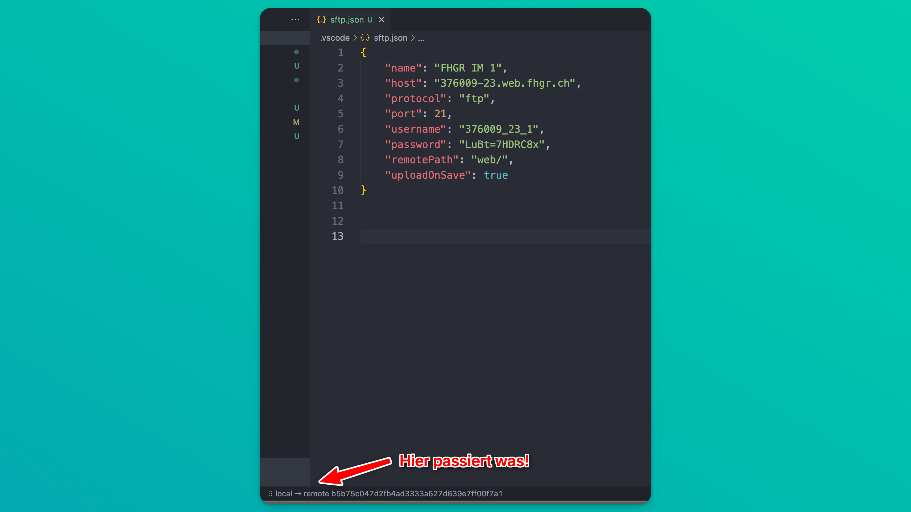

# Ausbildungsserver

Step-by-Step Anleitung, um einen Ausbildungsserver zu erstellen und Dateien  hochzuladen.

## Kapitelübersicht

- [Portal Ausbildungsserver](#portal-ausbildungsserver)
- [Ausbildungsserver erstellen](#ausbildungsserver-erstellen)
- [Mit dem Ausbildungsserver verbinden](#mit-dem-ausbildungsserver-verbinden)
- [SFTP Fehler verstehen und beheben](#sftp-fehler-verstehen-und-beheben)

## Portal Ausbildungsserver

1) Gehe auf [https://my.fhgr.ch/index.php?id=ftpstud](https://my.fhgr.ch/index.php?id=ftpstud)

2) Und logge dich rechts oben mit deinem FHGR-Campus Account ein.


- Dein Benutzername ist zusammengesetzt aus deinem Vor- und Nachnamen. Bspw. `schneenickjo`

## Ausbildungsserver erstellen

1) Nachdem du dich [eingeloggt](https://my.fhgr.ch/index.php?id=ftpstud) hast, klicke auf 'Neue Website erstellen'


- Es öffnet sich dieses Formular: 


Gib folgende Informationen ein:

- **Titel:** Der Titel deines Servers. 
    - Bspw. `Interaktive Medien` oder mit etwas mehr System `HS23_IM1_IMP_News`. 
    - Der Titel wird später nur hier im Portal in der Serverliste angezeigt und ist rein kosmetisch. Du brauchst diesen nirgendwo sonst.

- **Löschdatum:** Nimm ein Datum nach Abschluss deines Studiums, damit du deine Webseiten / Projekte nicht verlierst.
    - Lege deine Projekte NIE ausschliesslich auf dem Studiserver ab. Mach immer ein Backup auf GitHub, Dropbox oder lokal auf deinem Mac oder PC.

- **Datenbanken:** Normalerweise brauchst du keine Datenbank.

... und klicke anschliessend auf `Erstellen`. 

2) Nun wird dein Webserver hochgefahren. Das dauert normalerweise 15 Minuten bis 1 Stunde. Manchmal dauert es auch länger oder funktioniert gar nicht.


#### Status A – TLS Beheben

- Der Studiserver fährt hoch und *ist noch nicht bereit*. Es kann nicht auf den Server zugegriffen werden.

#### Status B – TLS Fehler

- Der Studiserver hat ein Problem. Es kann nicht auf den Server zugegriffen werden. Warte noch max. 1 Stunde. Wenn sich das Problem nicht von selbst löst, lösche den Server und erstelle einen neuen Server.

#### Status C – OK

- Der Studiserver ist bereit und kann verwendet werden.

## Mit dem Ausbildungsserver verbinden

1) Sobald der Status deines Ausbildungsservers `OK` ist, kannst du mit dem Server verbinden.

2) Klicke auf den Titel deines Ausbildungsservers.


3) Nun siehst du die Verbindungsinformationen für deinen Ausbildungsserver


    1) Die URL / Website / Adresse deines Webservers. Klicke hier, um deine Website anzuschauen.

    2) Der Hostname deines Webservers. Diesen brauchst du, um dich mit dem Webserver zu verbinden.

    3) Dein Benutzername. Diesen brauchst du, um dich mit dem Webserver zu verbinden.

    4) Dein Passwort. Dieses brauchst du, um dich mit dem Webserver zu verbinden.

4) Öffne deinen Code-Editor `Visual Studio Code` und öffne deinen Projektordner.

5) Falls noch nicht geschehen, lade die Extension / Erweiterung `SFTP` herunter und installiere sie.


    1) Gehe in der Sidebar auf `Extensions`
    2) Suche nach `SFTP`
    3) Wähle das korrekte Plugin von `Natizyskunk`
    4) Klicke auf `Install` (im Screenshot ist die Extension bereits installiert)

6) Wenn du die Extension installiert hast, gehe zurück in den Code Editor.

7) Drücke auf Mac `CMD + SHIFT + P` oder auf Windows `CTRL + SHIFT + P` um die Command Palette zu öffnen.

8) Gib `SFTP` ein und wähle `SFTP: Config` um eine neue `sftp.json` Datei zu erstellen.


9) Es öffnet sich automatisch die Datei `sftp.json`. Falls nicht, öffne die Datei manuell aus dem Ordner `.vscode` in deinem Projektordner.


10) Ersetze den Inhalt in `sftp.json` mit folgendem Inhalt:

```
{
    "name": "FHGR IM 1",
    "host": "replace-this-hostname",
    "protocol": "ftp",
    "port": 21,
    "username": "replace-this-username",
    "password": "replace-this-password",
    "remotePath": "web/",
    "uploadOnSave": true
}
```

11) Ersetze die Platzhalter bei `host`, `username` und `password` mit den Informationen von deinem Ausbildungsserver.


12) Speichere 'sftp.json' mit CMD / resp. CTRL + S

13) Öffne wiederum die Command-Palette mit `CMD + SHIFT + P` oder `CTRL + SHIFT + P` und gib `SFTP` ein. Wähle `SFTP: Sync Local -> Remote` und Klicke auf den Namen deiner Verbindung.


14) Wenn alles gut läuft siehst du keine Fehlermeldung. Und links unten im Code-Editor passiert was!



15) Prüfe, ob deine Dateien jetzt auf dem Server sind, indem du die Website öffnest.

 - Öffne dazu die URL (1) auf myCampus.


## SFTP Fehler verstehen und beheben

- [JSON at position x](#json-at-position-x)
- [Timed out while waiting for handshake](#timed-out-while-waiting-for-handshake)
- [Timeout while connecting to server](#timeout-while-connecting-to-server)
- [Login authentication failed](#login-authentication-failed)
- [Can't create directory: Operation not permitted](#cant-create-directory-operation-not-permitted)


#### JSON at position x


- Du hast wohl ein Komma, Anführungszeichen oder ähnliches zu viel in deiner JSON Datei. Prüfe die Datei auf Fehler.

#### Timed out while waiting for handshake


- In der `sftp.json` stimmt der `Hostname` nicht.
- In der `sftp.json` wurde fürs Protokoll `sftp` statt `ftp` gewählt.

#### Timeout while connecting to server

- In der `sftp.json` stimmt der `Port` nicht. Der Port muss `21` sein.

#### Login authentication failed


- In der `sftp.json` stimmt der `Benutzername` oder das `Passwort` nicht.


#### Can't create directory: Operation not permitted


- Die `sftp.json` Datei wurde nicht mit der Datei aus dieser Anleitung überschrieben. 

1) Ersetze den **GESAMTEN INHALT** von `sftp.json` mit untenstehendem Inhalt. 
2) Ersetze dann `host`, `username` und `password` mit den Informationen von deinem Ausbildungsserver.

```
{
    "name": "FHGR IM 1",
    "host": "replace-this-hostname",
    "protocol": "ftp",
    "port": 21,
    "username": "replace-this-username",
    "password": "replace-this-password",
    "remotePath": "web/",
    "uploadOnSave": true
}
```