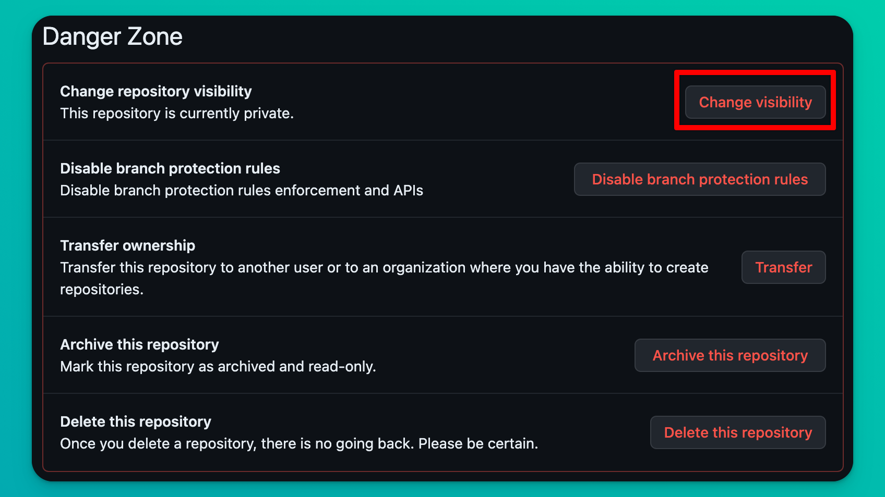
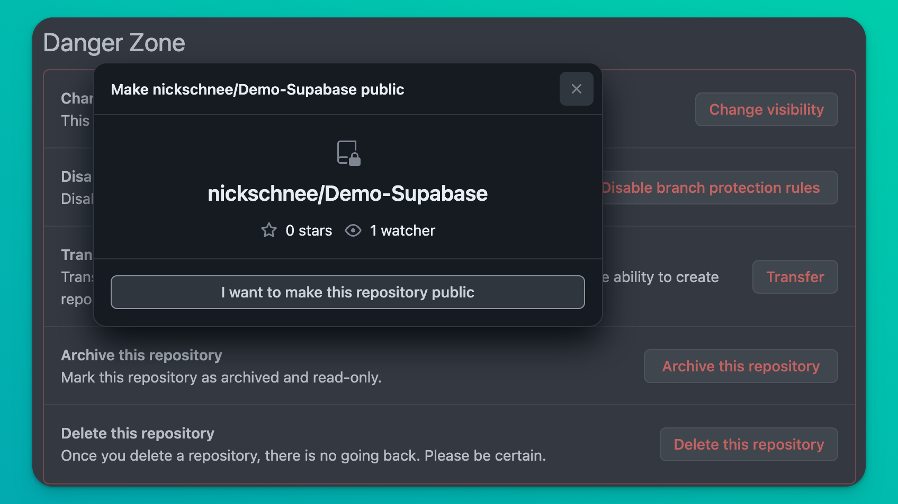
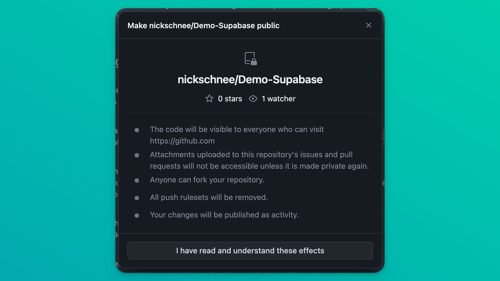
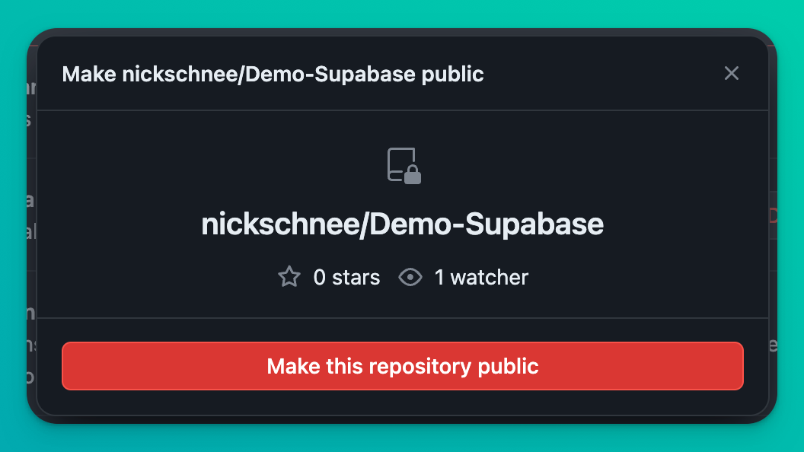

# GitHub Public Repositorys

Stelle dein Repository auf `Public` (statt `Private`), damit es von den Dozierenden bewertet werden kann.

## 1) Überprüfe dein Repository auf sensible Daten

Bevor du dein Repository auf `Public` stellst, solltest du sicherstellen, dass du keine sensiblen Daten hochgeladen hast. Dazu gehören `Passwörter`, `API Keys` und `andere Zugangsdaten`.

### Projekte mit Supabase

Wenn du mit **Supabase** arbeitest, solltest du ein `.gitignore` File im Root-Ordner deines Projekts erstellen und dort den Pfad zum `supabase.js` File eingeben, damit GitHub dieses ignoriert und nicht hochlädt. Denn dort befinden sich die API-Keys, wie auf deine Datenbank zugegriffen werden kann.

Hier findest du die offizielle Anleitung von GitHub dazu: [Dateien Ignorieren](https://docs.github.com/de/get-started/getting-started-with-git/ignoring-files) 

## 2) Stelle dein Repository auf Public

1) Gehe auf [GitHub](https://www.github.com) und logge dich ein.
2) Wähle in der Seitenleiste dein Repository aus.
3) Klicke auf `Settings` (oben rechts).

4) Scrolle nach unten bis zum Abschnitt `Danger Zone`.

5) Wähle dort 'Change Visibility' und anschliessend `Change to Public`.

*Wenn stattdessen `Change to Private` angezeigt wird, ist dein Repository bereits öffentlich und du musst keine weiteren Schritte unternehmen.*

6) Bestätige über den Button `I want to make this Repository public`.

7) Bestätige ein weiteres Mal über den Button `I have read and understand these effects`.

8) Bestätige ein drittes Mal über den Button `Make this Repository Public` und gib dein Passwort ein, wenn du danach gefragt wirst.

Dein Repository ist nun `Public`.

