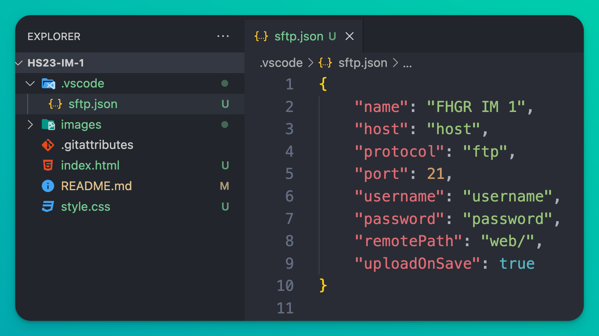

## SFTP Konfiguration

Bitte verwendet ab sofort diese Konfiguration für eure `sftp.json` Datei (gesamten Inhalt ersetzen):

```JSON

{
    "name": "beliebiger-name",
    "host": "replace-this-hostname",
    "protocol": "ftp",
    "port": 21,
    "username": "replace-this-username",
    "password": "replace-this-password",
    "remotePath": "/",
    "uploadOnSave": true,
    "ignore": [
        ".vscode",
        ".git"
    ]
}

```

Falls ihr auf dem Studierenden-Server arbeitet, ersetzt bei "remotePath": `"/"` mit `"/web"`

## Anleitung Installation SFTP-Plugin

1. Öffne deinen Code-Editor `Visual Studio Code` und öffne deinen Projektordner.

2. Falls noch nicht geschehen, lade die Extension / Erweiterung `SFTP` herunter und installiere sie.


    1) Gehe in der Sidebar auf `Extensions`
    2) Suche nach `SFTP`
    3) Wähle das korrekte Plugin von `Natizyskunk`
    4) Klicke auf `Install` (im Screenshot ist die Extension bereits installiert)

3. Wenn du die Extension installiert hast, gehe zurück in den Code Editor.

4. Drücke auf Mac `CMD + SHIFT + P` oder auf Windows `CTRL + SHIFT + P` um die Command Palette zu öffnen.

5. Gib `SFTP` ein und wähle `SFTP: Config` um eine neue `sftp.json` Datei zu erstellen.


6. Es öffnet sich automatisch die Datei `sftp.json`. Falls nicht, öffne die Datei manuell aus dem Ordner `.vscode` in deinem Projektordner.



7. Ersetze den Inhalt in `sftp.json` mit folgendem Inhalt:

```
{
    "name": "beliebiger-name",
    "host": "replace-this-hostname",
    "protocol": "ftp",
    "port": 21,
    "username": "replace-this-username",
    "password": "replace-this-password",
    "remotePath": "/",
    "uploadOnSave": true,
    "ignore": [
        ".vscode",
        ".git"
    ]
}
```

8. Ersetze die Platzhalter bei `host`, `username` und `password` mit den Informationen von deinem Hosting-Anbieter. Bei `name` kannst du einen beliebigen Namen wählen.


9. Speichere 'sftp.json' mit CMD / resp. CTRL + S

10. Öffne wiederum die Command-Palette mit `CMD + SHIFT + P` oder `CTRL + SHIFT + P` und gib `SFTP` ein. Wähle `SFTP: Sync Local -> Remote` und Klicke auf den Namen deiner Verbindung.


11. Wenn alles gut läuft siehst du keine Fehlermeldung. Und links unten im Code-Editor passiert was!


12. Prüfe, ob deine Dateien jetzt auf dem Server sind, indem du die Website öffnest.
